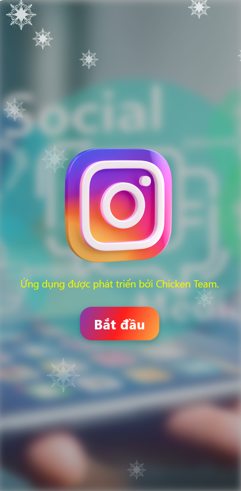

---

# 📘 **README.md **

````md
# 📱 Chicken-Insta — Mobile Social App (React Native + Expo)

Chicken-Instagram is a social networking mobile application inspired by Instagram.  
It is built using **React Native (Expo)** combined with **Firebase**, **Cloudinary**, and **Redux Toolkit**.

The app allows users to create posts with images/videos, browse a feed, manage profiles, and more — making it an excellent learning project for mobile development.

---

👥 Contributors

@tualearncode – Team leader, Onboarding Screen, Home Feed, Post Upload (Uploading images using Cloudinary), Post Detail, Interaction, App Navigation, State Management.

@Crabbercat – Login / Register, Reset Forgot Password, Follow System, Profile Screen, Edit Profile, Account Settings, Backend Integration, Deployment.

@Hrk9324 – Notifications, Search Screen, Explore Screen, Chat Screen, Chat List.
## 📚 Table of Contents

* [Introduction](#introduction)
* [Application UI](#application-ui)
* [Technologies Used](#technologies-used)
* [Folder Structure](#folder-structure)
* [How to Run](#how-to-run)

---

## 📝 Introduction

Chicken-Instagram is a mini social media mobile app designed to simulate Instagram features including:

* Uploading images
* Creating posts with captions
* Uploading images to **Cloudinary**
* Storing post metadata in **Firebase Firestore**
* Browsing the home feed
* User authentication
* Profile management
* Basic chat UI
---

## ⭐ Application UI


---

## ⚙️ Technologies Used

| Technology             | Purpose                           |
| ---------------------- | --------------------------------- |
| **Expo**               | Development and build environment |
| **Expo Router**        | File-based routing system         |
| **React Native**       | UI framework                      |
| **Redux Toolkit**      | Global state management           |
| **Firebase Firestore** | Data storage                      |
| **Firebase Auth**      | User authentication               |
| **Cloudinary**         | Image uploads                     |
| **TypeScript**         | Type-safe development             |

---

## 📁 Folder Structure

```
app/
 ├── auth/           # Index, Login, Register, Onboarding
 ├── chat/           # Chat screens
 ├── components/     # BottomBars, TopBar...
 ├── tmp/            # Home, Post, Explore, Search, Profile...
 ├── user/           # User profile, edit
lib/
 ├── firebase.tsx    # Firebase config
redux/
 ├── authSlice.ts
 ├── userSlice.ts
 ├── store.ts
assets/              # Images, icons
```

---

## How to Run

1. Install dependencies

   ```bash
   npm install
````

2. Start the app

   ```bash
   npx expo start
   ```

In the output, you'll find options to open the app in a:

* [development build](https://docs.expo.dev/develop/development-builds/introduction/)
* [Android emulator](https://docs.expo.dev/workflow/android-studio-emulator/)
* [iOS simulator](https://docs.expo.dev/workflow/ios-simulator/)
* [Expo Go](https://expo.dev/go), a limited sandbox for trying out app development with Expo

You can start developing by editing the files inside the **app** directory.
This project uses [file-based routing](https://docs.expo.dev/router/introduction).

## Get a fresh project

When you're ready, run:

```bash
npm run reset-project
```

This command will move the starter code to the **app-example** directory
and create a blank **app** directory where you can start developing.

## Learn more

To learn more about developing your project with Expo, check out:

* [Expo documentation](https://docs.expo.dev/)
* [Learn Expo tutorial](https://docs.expo.dev/tutorial/introduction/)

## Join the community

* [Expo on GitHub](https://github.com/expo/expo)
* [Discord community](https://chat.expo.dev)

---

## ❤️ Thank you for checking out our project!

```

---

